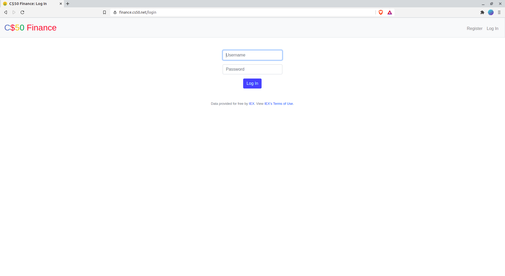

## cs50 Finance 
This repository Is an overview of  my solutions to Harvard 
University's CS50 Finance Problem set

## Youtube Video
A short in which i work through the required specs of the project:
<a href='#'>View the Demo on Youtube</a>

## About The Project
This project is an educational project, one of the CS50x Problem set.
by the way CS50x is the Introduction to the intellectual enterprises of computer science and the art of programming.

## Specification 
1. **Register**
Complete the implementation of register in such a way that it allows a user to register for an account via a form.

  - Require that a user input a username, implemented as a text field whose name is username. Render an apology if the user’s input is blank or the username already exists.
  - Require that a user input a password, implemented as a text field whose name is password, and then that same password again, implemented as a text field whose name is confirmation. Render an apology if either input is blank or the passwords do not match.
  - Submit the user’s input via POST to /register.
  - INSERT the new user into users, storing a hash of the user’s password, not the password itself. Hash the user’s password with <a href='https://werkzeug.palletsprojects.com/en/0.14.x/utils/#werkzeug.security.generate_password_hash.*'>generate_password_hash<a>Odds are you’ll want to create a new template (e.g., register.html) that’s quite similar to login.html.

Once you’ve implemented register correctly, you should be able to register for an account and log in (since login and logout already work)! And you should be able to see your rows via phpLiteAdmin or sqlite3.

2. **Quote**
Complete the implementation of quote in such a way that it allows a user to look up a stock’s current price.

  - Require that a user input a stock’s symbol, implemented as a text field whose     name is symbol.
  - Submit the user’s input via POST to /quote.
  - Odds are you’ll want to create two new templates (e.g., quote.html and quoted.html). When a user visits /quote via GET, render one of those templates, inside of which should be an HTML form that submits to /quote via POST. In response to a POST, quote can render that second template, embedding within it one or more values from lookup.
3. **Buy**
Complete the implementation of buy in such a way that it enables a user to buy stocks.

  - Require that a user input a stock’s symbol, implemented as a text field whose name is symbol. Render an apology if the input is blank or the symbol does not exist (as per the return value of lookup).
  - Require that a user input a number of shares, implemented as a text field whose name is shares. Render an apology if the input is not a positive integer.
  - Submit the user’s input via POST to /buy.
  - Odds are you’ll want to call lookup to look up a stock’s current price.
  - Odds are you’ll want to SELECT how much cash the user currently has in users.
  - Add one or more new tables to finance.db via which to keep track of the purchase. Store enough information so that you know who bought what at what price and when.
    - Use appropriate SQLite types.
    - Define UNIQUE indexes on any fields that should be unique.
    - Define (non-UNIQUE) indexes on any fields via which you will search (as via SELECT with WHERE).
  - Render an apology, without completing a purchase, if the user cannot afford the number of shares at the current price.
  - You don’t need to worry about race conditions (or use transactions).
Once you’ve implemented buy correctly, you should be able to see users’ purchases in your new table(s) via phpLiteAdmin or sqlite3.

4. **Index**
Complete the implementation of index in such a way that it displays an HTML table summarizing, for the user currently logged in, which stocks the user owns, the numbers of shares owned, the current price of each stock, and the total value of each holding (i.e., shares times price). Also display the user’s current cash balance along with a grand total (i.e., stocks’ total value plus cash).

 - Odds are you’ll want to execute multiple SELECTs. Depending on how you implement your table(s), you might find GROUP BY HAVING SUM and/or WHERE of interest.
 - Odds are you’ll want to call lookup for each stock.
5. **Sell**
Complete the implementation of sell in such a way that it enables a user to sell shares of a stock (that he or she owns).

  - Require that a user input a stock’s symbol, implemented as a select menu whose name is symbol. Render an apology if the user fails to select a stock or if (somehow, once submitted) the user does not own any shares of that stock.
  - Require that a user input a number of shares, implemented as a text field whose name is shares. Render an apology if the input is not a positive integer or if the user does not own that many shares of the stock.
  - Submit the user’s input via POST to /sell.
  - You don’t need to worry about race conditions (or use transactions).
6. **history**
Complete the implementation of history in such a way that it displays an HTML table summarizing all of a user’s transactions ever, listing row by row each and every buy and every sell.

  - For each row, make clear whether a stock was bought or sold and include the stock’s symbol, the (purchase or sale) price, the number of shares bought or sold, and the date and time at which the transaction occurred.
  - You might need to alter the table you created for buy or supplement it with an additional table. Try to minimize redundancies.
7. **personal touch**
Implement at least one personal touch of your choice:

  - Allow users to change their passwords.
  - Allow users to add additional cash to their account.
  - Allow users to buy more shares or sell shares of stocks they already own via index itself, without having to type stocks’ symbols manually.
  - Require users’ passwords to have some number of letters, numbers, and/or symbols.
  - Implement some other feature of comparable scope.

## Staff Solution: 
Here is the Staff Solution which Looks most likely the same apart form some styles choices i aplire to my solution.
<a href="https://finance.cs50.net/">C$50 Finance</a>

### Disclaimer:

Please! don't just copy the code mindlessly without trying to solve the problems yourself, it's totally pointless if you actually wanna learn Programing and a flagrant violation of the [**Academic Honesty**](https://docs.cs50.net/2016/fall/syllabus/cs50.html#academic-honesty) policy of the course.

##  How to Take this Course

Even if you are not a student at Harvard, you can take this course for free via this OpenCourseWare:<a href='https://www.edx.org/'>edX</a>
If you’d like to submit the course’s problem sets and final project for feedback, be sure to create an edX account, if you haven’t already. 
If interested in a verified certificate from edX, enroll at <a href="https://www.edx.org/course/cs50s-introduction-to-computer-science">cs50.edx.org</a>instead.

Also You can find the specs for all problem sets as well as the course materials  <a href='https://cs50.harvard.edu/x/2020/'>here</a> or read carefully the assignments specifications above-mentioned.